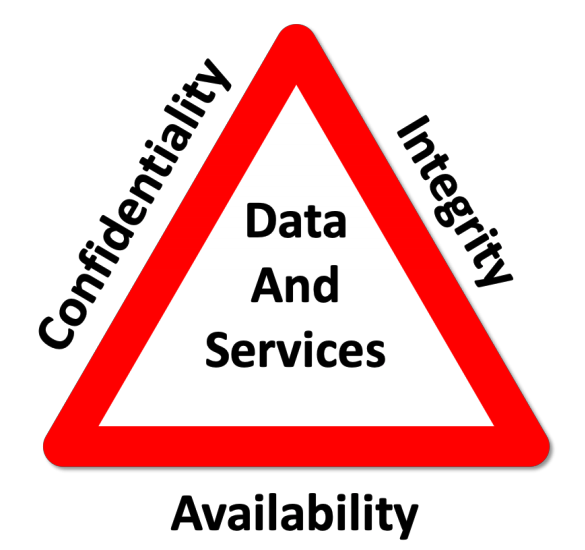

<!-- slide -->
## Question 1
We have looked at some static analysis tools like StyleCop, PMD, FindBugs and SonarLint. 

Explain how static analysis can improve code quality.

Explain how it helped you or could have helped you in your project.

<!-- slide -->

## Static Analysis

What is it, Examples & Benefits

<!-- slide -->

## What is Static Analysis?

<!-- slide -->

## Static Analysis Tools

|||
|---|---|
| StyleCop | Coding standards |
| FindBugs | Bugs & potential bugs |
| PMD | Warns Against bad practice |

<!-- slide -->

## More Tools
Sonar stores result for later analysis

* Trends
* Reports

<!-- slide -->

## Security

<!-- slide -->

## Even More Tools

Static Application Security Testing (SAST)

_e.g. SQL injection & cross-site scripting_

<!-- slide -->

## Benefits
User finds bug (weeks, months, years)
QA finds bug (days, weeks)
Test finds bug (hours, minutes)

**Static analyzer finds bug (seconds)**

<!-- slide -->

## The Project
