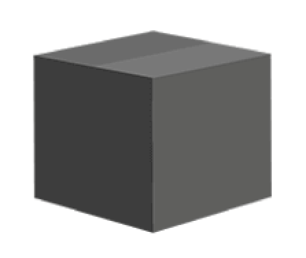

<!-- slide -->
## Question 10
Characterize high quality software. 

---
Explain how writing tests can increase code quality.

<!-- slide -->

## Why Testing?


_Murhy’s law_
_**"Anything that can go wrong will go wrong"**_

<!-- slide -->

## Defensive programming
Assert Positive and Negative Scenarios
Handle Exceptions

<!-- slide --->

## Black-box development


<!-- slide --->

## Interfaces, contracts
|||
|---|---|
|Interface| Class Rules |
|Contract| System Rules |

<!-- slide --->

## Inversion of control


<!-- slide --->

## Dependency injection
Problem
```java
foo(String name, int age) {
    User user = new User(name, age);
    // code here ...
}
```

Solution
```java
foo(IUser user) {
    // code here...
}
```
```java
IUser user = new User(name, age);
foo(user);
```

<!-- slide --->

## The Project