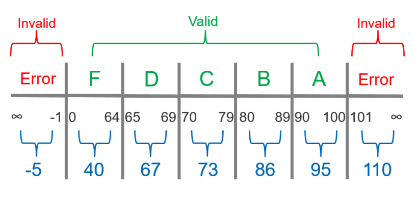

<!-- slide -->
## Question 13
### Explain specification-based testing, and how you can be more confident that you have written a sufficient amount of tests.

<!-- slide -->

## Equivalence partitioning
  

<!-- slide --->

## Boundary value analysis

<!-- slide --->

## Edge cases

<!-- slide --->

## Decision tables

<!-- slide --->

## Code Coverage

<!-- slide --->

## Path Coverage

<!-- slide --->

<!-- slide --->

## The Project