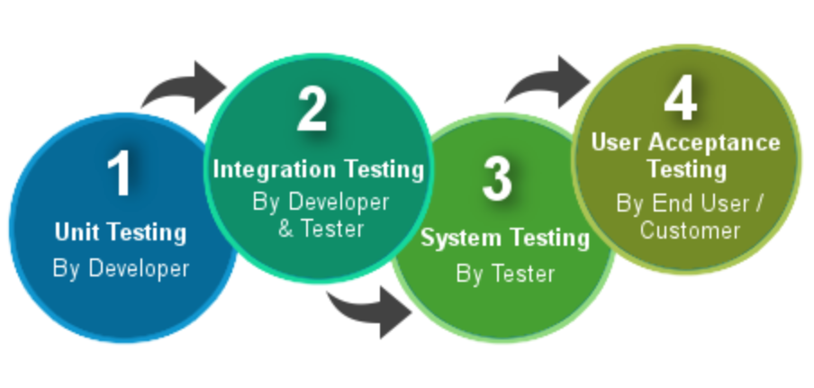
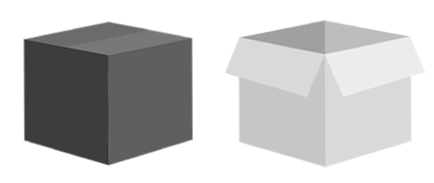
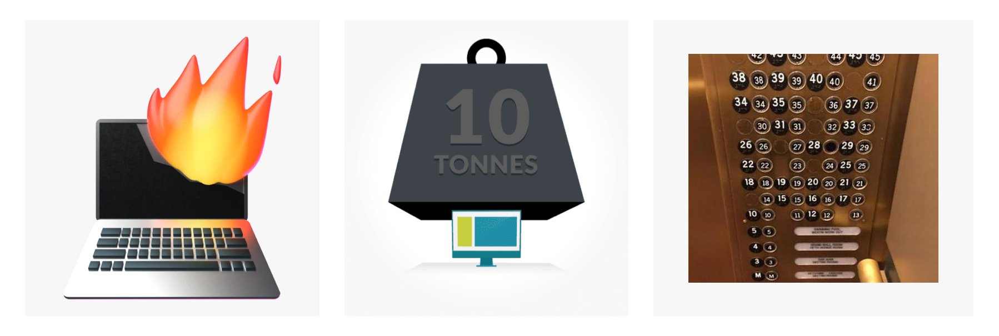
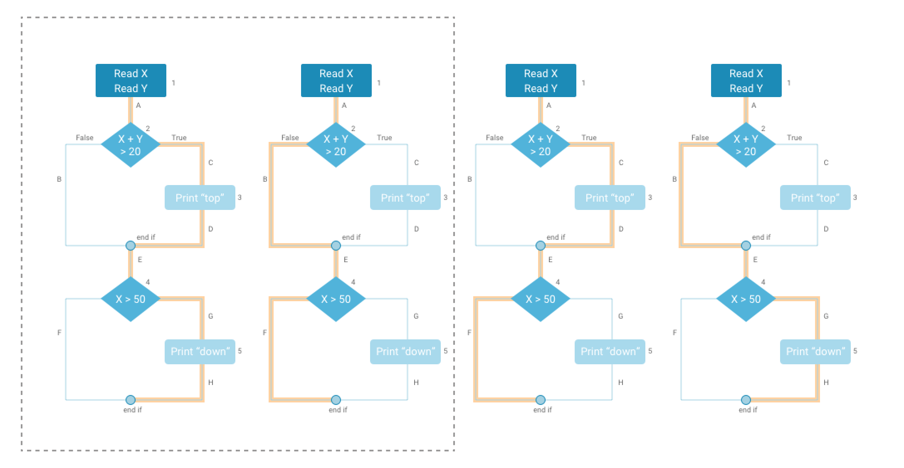
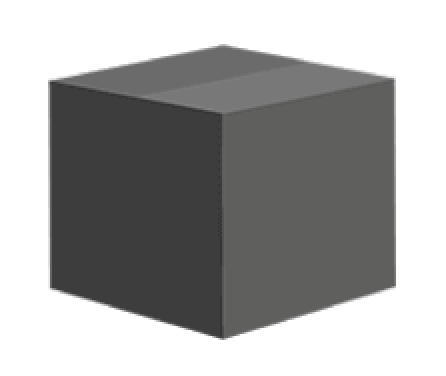

<!-- slide -->

## Question 2
### Explain test levels, and what characterizes the individual levels. 
### Then, relate to your own project.

<!-- slide -->

## Test Levels

<!-- slide -->

## Unit testing

Testing: A, B, C & D

<!-- slide -->

## Integration testing

Testing: A → B, B → C & C → D

<!-- slide -->

## System testing

Testing: A ···→ D

<!-- slide -->

## System Testing Types
Recovery testing, Load testing, Usability testing
And a lot more..

<!-- slide -->

## Code & Path Coverage

<!-- slide -->

## Acceptance testing

<!-- slide -->

## Static testing

<!-- slide -->

## The Project