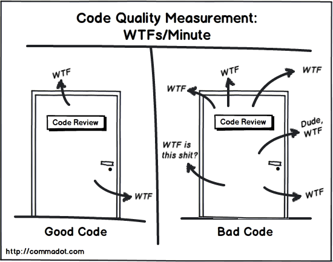
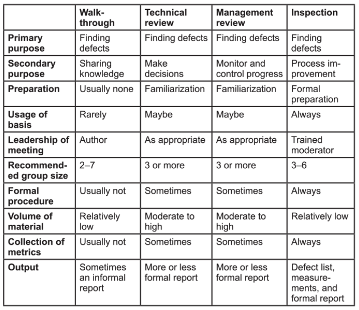

<!-- slide -->
## Question 3

### Explain what kinds of test can be carried out without running any code.
### Explain how it can be used on non-code documents as well.

<!-- slide -->

## Manual Code Review


<!-- slide -->

## Cyclomatic Complexity
```java
foo() {
    if (condition) {                    // CC 1

        if (condition) {                // CC 2
            // code here...
        }

        while (condition) {             // CC 3

            if (condition) {            // CC 4
                // code here...
            } else {                    // CC 5
                // code here...
            }

        }  
    }
}
```

<!-- slide -->

## Reviews


<!-- slide -->

## Technical reviews

<!-- slide -->

## Management reviews

<!-- slide -->

## Audit

<!-- slide -->

## Static analysis

<!-- slide -->

## Linters

<!-- slide -->

## The Project