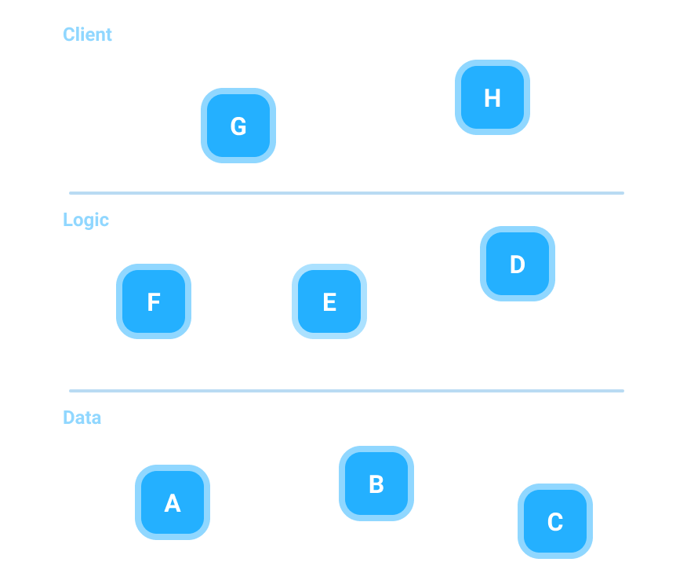
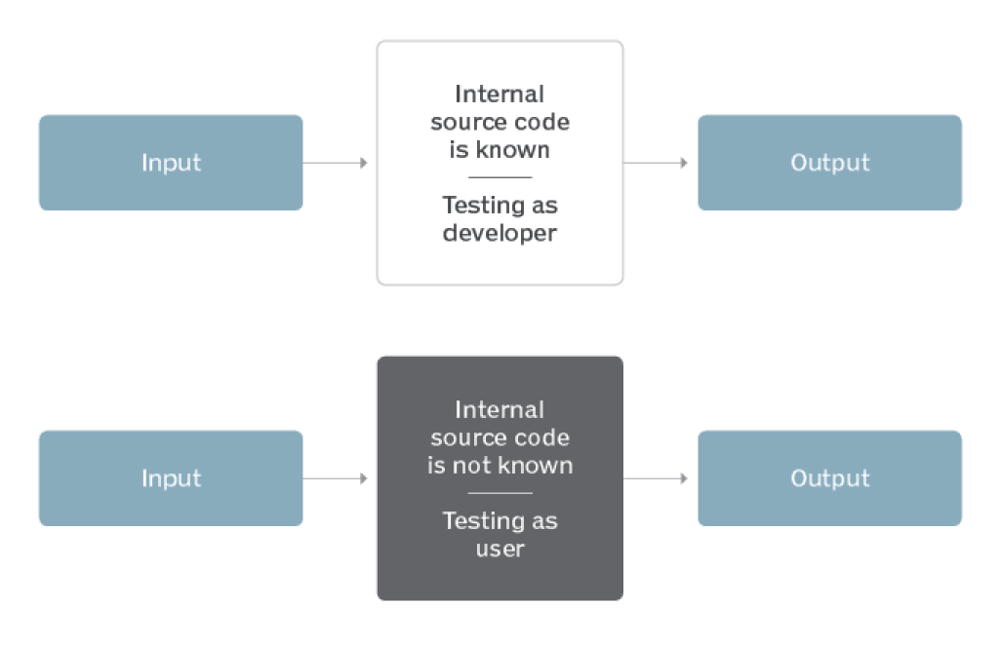

<!-- slide -->

## Question 4
---
Explain test activities,
and how they are related to each other. 

---
Then explain the test activities
you carried out in your project.

<!-- slide -->

## Test Levels

<!-- slide -->

## Unit testing

<!-- slide -->

## Integration testing

<!-- slide -->

## System testing

<!-- slide -->

## Acceptance testing

<!-- slide -->

## Black Box & White Box Testing

<!-- slide -->

## Code & Path Coverage

<!-- slide -->

## Refactoring

<!-- slide -->

## Maintenance
Reviews, TDD & Continuous Integration

<!-- slide -->

## Continuous Integration

JUnit5 `@Tag` helps CI.

<!-- slide -->

## Code reviews
No direct push to branch, only pull-request.

<!-- slide -->

## The Project