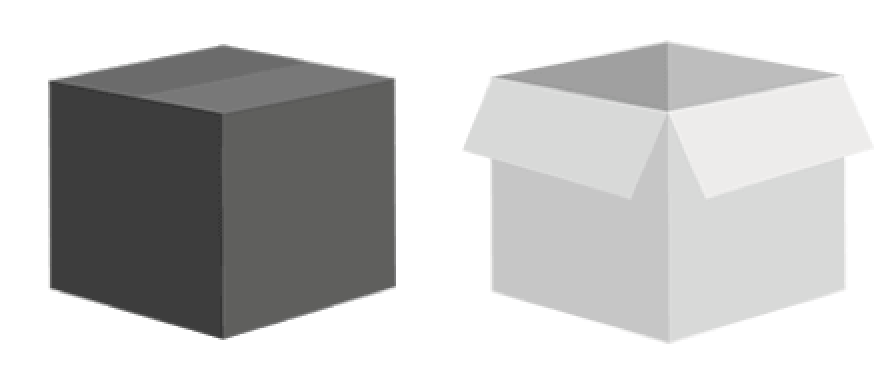
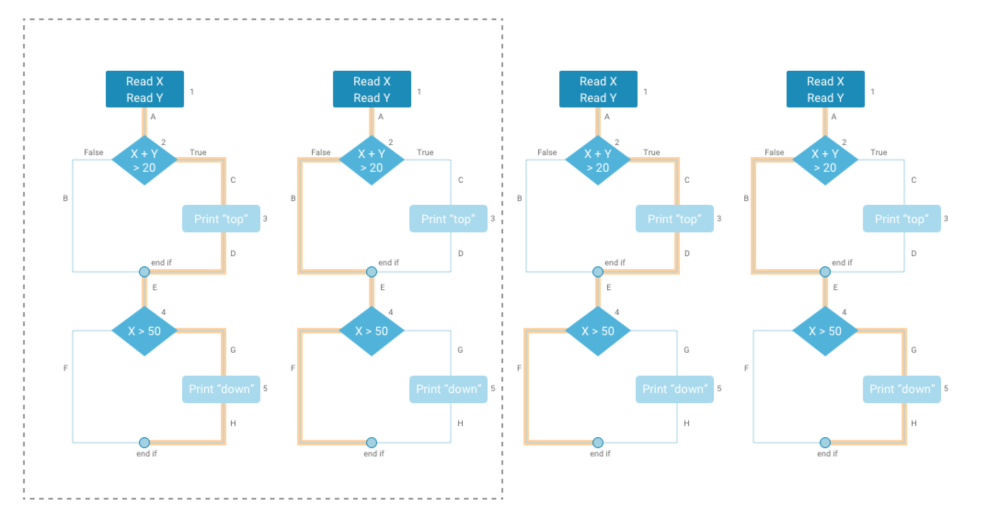

<!-- slide -->
## Question 4
### Explain test activities, and how they are related to each other. 
### Then explain the test activities you carried out in your project.

<!-- slide -->

## Test Levels

<!-- slide -->

## Unit testing

Testing: A, B, C & D

<!-- slide -->

## Integration testing

Testing: A → B, B → C & C → D

<!-- slide -->

## System testing

Testing: A ···→ D

<!-- slide -->

## Acceptance testing

<!-- slide -->

## Code & Path Coverage

<!-- slide -->

## Refactoring

<!-- slide -->

## Maintenance

<!-- slide -->

## Continuous Integration

<!-- slide -->

## Code reviews

<!-- slide -->

## The Project