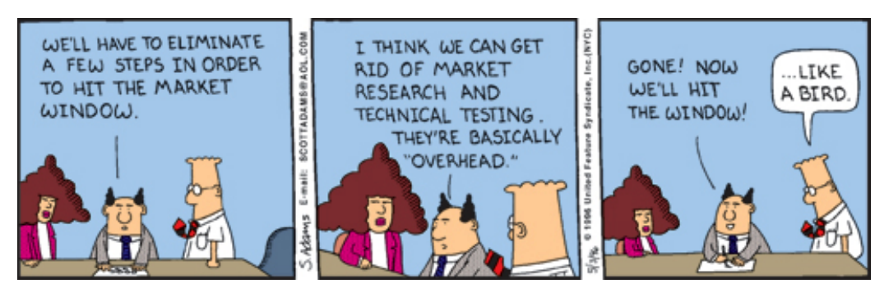
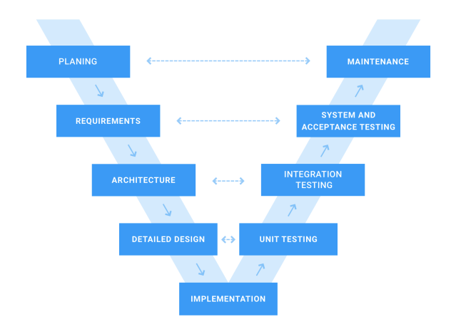
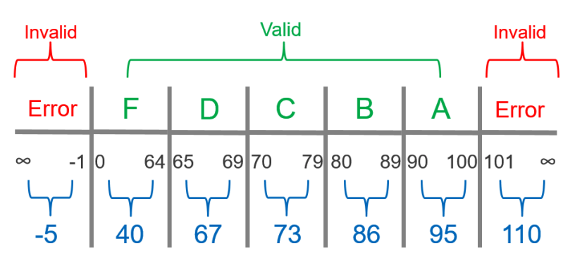

<!-- slide -->

## Question 5
Testing is related to ensuring higher code quality. 

---
Elaborate on what characterizes high code quality,
and what makes code testable.

<!-- slide -->

## Why Testing?


<!-- slide -->

## Testable code


<!-- slide --->

## Names of tests

```java
// test[Feature being tested]
testIsNotAnAdultIfAgeLessThan18
```

```java
// Should_ExpectedBehavior_When_StateUnderTest
Should_ThrowException_When_AgeLessThan18
```

[source](https://dzone.com/articles/7-popular-unit-test-naming)

<!-- slide --->

## “sufficient” tests of a method or class
Equivalence Partitions
Code & Path Coverage

<!-- slide --->
## Equivalence Partitions
  

<!-- slide --->

## Code Coverage


<!-- slide --->

## Path Coverage


<!-- slide --->

## Assertions, defensive programming
Assert Positive and Negative Scenarios
Handle Exceptions

_Murhy’s law_
_**"Anything that can go wrong will go wrong"**_

<!-- slide --->

## Dependency injection
Problem
```java
foo(String name, int age) {
    User user = new User(name, age);
    // code here ...
}
```

Solution
```java
foo(IUser user) {
    // code here...
}
```
```java
IUser user = new User(name, age);
foo(user);
```

<!-- slide -->

## The Project