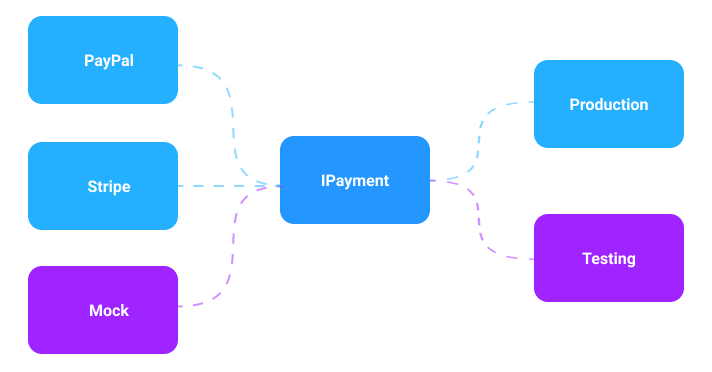

<!-- slide -->

## Question 6
---
Explain the concept of maintainable code,
and how it’s related to test. 

---
Explain how to find out if a code base is maintainable.

<!-- slide --->

## Temporal coupling

Example
```java
var calculator = new PriceCalculator();
calculator.UpdateCurrencyRates(eur: 1.02, gbp: 1.25);
decimal price = calculator.CalculatePrice(myShoppingCart);
```

Solution
```java
var calculator = new PriceCalculator(eur: 1.02, gbp: 1.25);
decimal price = calculator.CalculatePrice(myShoppingCart);
```

<!-- slide --->

## Continuous Integration

JUnit5 `@Tag` helps CI.

<!-- slide --->

## Static Analysis
|||
|---|---|
| StyleCop | Coding standards |
| FindBugs | Bugs & potential bugs |
| PMD | Warns Against bad practice |

<!-- slide --->

## Inversion of Control


<!-- slide --->

## Dependency Injection

Problem
```java
foo(String name, int age) {
    User user = new User(name, age);
    // code here ...
}
```

Solution
```java
foo(IUser user) {
    // code here...
}
```
```java
IUser user = new User(name, age);
foo(user);
```

<!-- slide --->

## Low coupling & high cohesion

<!-- slide --->

## Cyclomatic code complexity

```java
foo() {
    if (condition) {                    // CC 1

        if (condition) {                // CC 2
            // code here...
        }

        while (condition) {             // CC 3

            if (condition) {            // CC 4
                // code here...
            } else {                    // CC 5
                // code here...
            }

        }  
    }
}
```

<!-- slide --->

## The Project