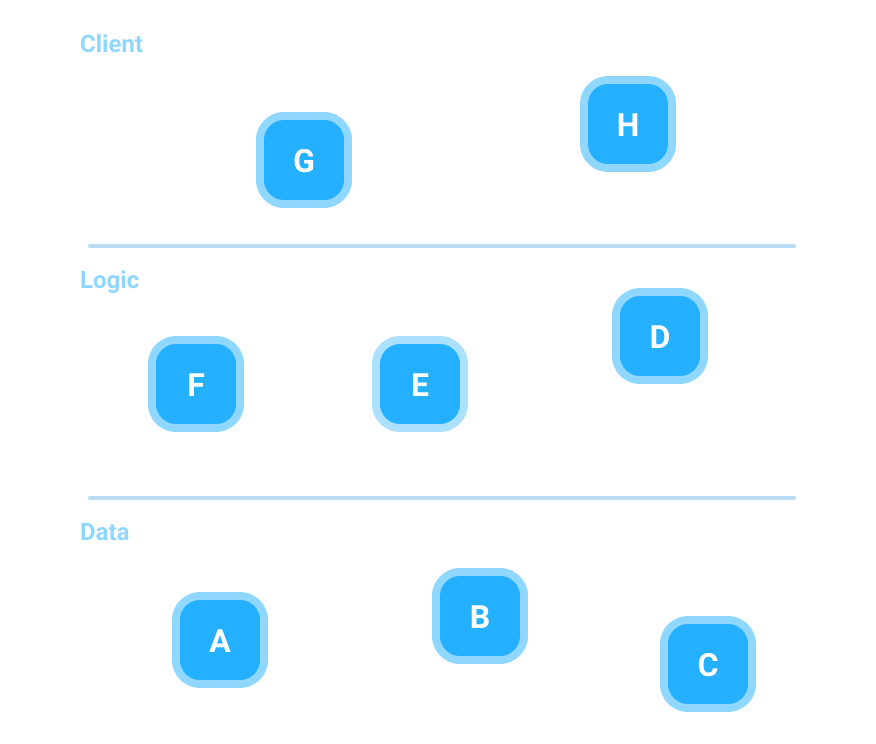
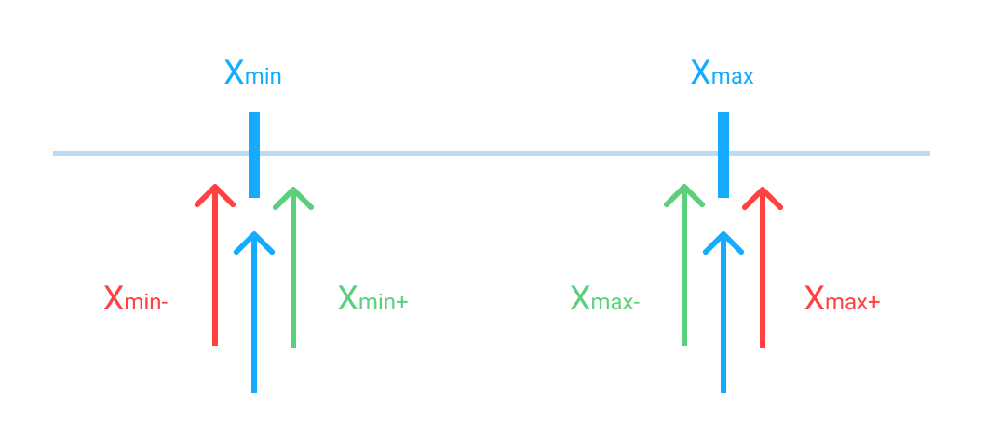

<!-- slide -->
## Question 7

---
Explain unit testing, and what characterizes it
in contrast to other types of test.

<!-- slide -->

## What and why

<!-- slide --->

## What is Unit testing?


<!-- slide -->

## Why Unit testing?
* High Quality Software
* Avoid / Reduce Technical Debt
* Maintainability
* Scalability

<!-- slide -->

## Unit Under Test & System Under Test

<!-- slide --->

## Unit test lifecycle
BeforeAll, AfterAll, SetUp & TearDown

```java
@SetUp();       // @BeforeClass

@BeforeAll();   // @BeforeEach()
Test1() { ... }
@AfterAll();    // @AfterEach()

@AfterAll();    // @BeforeEach()
Test2() { ... }
@BeforeAll();   // @AfterEach()

@TearDown();    // @AfterClass
```

<!-- slide --->

## Test doubles
|||
|---|---|
| **Dummy** | Doesn't know anything |
| **Stub** | Knows what you told it |
| **Spy** | Stub with features |
| **Mock** | Expects a lot |
| **Fake** | You cant tell the difference |

<!-- slide --->

## Dummy
Doesn't know anything
```java
class BackendDummy implements IBackend {
    public String getUser(int id) {
        throw new NotImplementedException();
    }

    public int getRequestCount() {
        throw new NotImplementedException();
    }
}  
```

<!-- slide --->

## Stub
Knows what you told it
```java
class BackendStub implements IBackend {
    public String getUser(int id) {
        return new User();
    }

    public int getRequestCount() {
        return 10;
    }
}  
```

<!-- slide --->

## Spy
Stub with features
```java
class BackendStub implements IBackend {
    private int requestCount = 0;
    
    public String getUser(int id) {
        requestCount ++;
        return new User();
    }

    public int getRequestCount() {
        return requestCount;
    }
}  
```

<!-- slide --->

## Mock
Expects a lot
```java
@Rule
public JUnitRuleMockery context = new JUnitRuleMockery();

@Test
final Movement deposit = context.mock(Movement.class, "deposit");

context.checking(new Expectations() {{
    oneOf(deposit).getAmount();
    will(returnValue(100_00L));
}});

long mockResult = deposit.getAmount(); // 100_00L
```

<!-- slide --->

## Fake
You cant tell the difference
```java
class BackendStub implements IBackend {
    private List<User> users = new ArrayList(); // pre-populated
    private int requestCount = 0;
    
    public String getUser(int id) {
        requestCount ++;
        return users.get(id);
    }

    public int getRequestCount() {
        return requestCount;
    }
}  
```

<!-- slide --->

## Matchers(Hamcrest)

```java
// junit assertions
assertTrue(true == true);
assertFalse(true != false);

// hamcrest matcher assertions
assertThat(x, equal_to(y))
assertThat(x, is_not(equal_to(y)))
```

Hamcrest and Collections
```java
List<Integer> list = new ArrayList(5, 2, 4);

assertThat(list, hasSize(3));
assertThat(list, contains(5, 2, 4));
assertThat(list, containsInAnyOrder(2, 4, 5))
assertThat(list, everyItem(greaterThan(1)));
```

<!-- slide --->

## Test Driven Development


<!-- slide --->

## Dependency injection
Problem
```java
foo(String name, int age) {
    User user = new User(name, age);
    // code here ...
}
```

Solution
```java
foo(IUser user) {
    // code here...
}
```
```java
IUser user = new User(name, age);
foo(user);
```

<!-- slide -->

## Equivalence classes, boundary value analysis, equivalence partitions
  

<!-- slide --->

## Boundary value analysis


<!-- slide -->

## The Project