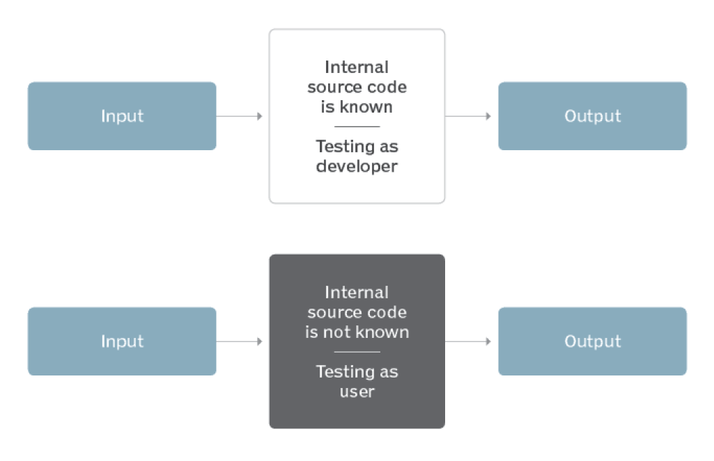

<!-- slide -->
## Question 9
### Explain about test doubles. Explain how and why mocking is useful, and in what test areas.

<!-- slide -->

## What is Mocking

<!-- slide -->

## Mocks, Spies
## Stubs, Fakes & Dummies

|||
|---|---|
| **Dummy** | Doesn't know anything |
| **Stub** | Knows what you told it |
| **Spy** | Stub with features |
| **Mock** | Expects a lot |
| **Fake** | You cant tell the difference |

<!-- slide --->

## What is JMock
A Mocking Library for Java

<!-- slide --->

## Dependency injection
Problem
```java
foo(String name, int age) {
    User user = new User(name, age);
    // code here ...
}
```

Solution
```java
foo(IUser user) {
    // code here...
}
```
```java
IUser user = new User(name, age);
foo(user);
```

<!-- slide --->

## Interfaces, contracts
|||
|---|---|
|Interface| Class Rules |
|Contract| System Rules |

<!-- slide --->

## Black-box vs white-box


<!-- slide --->

## The Project