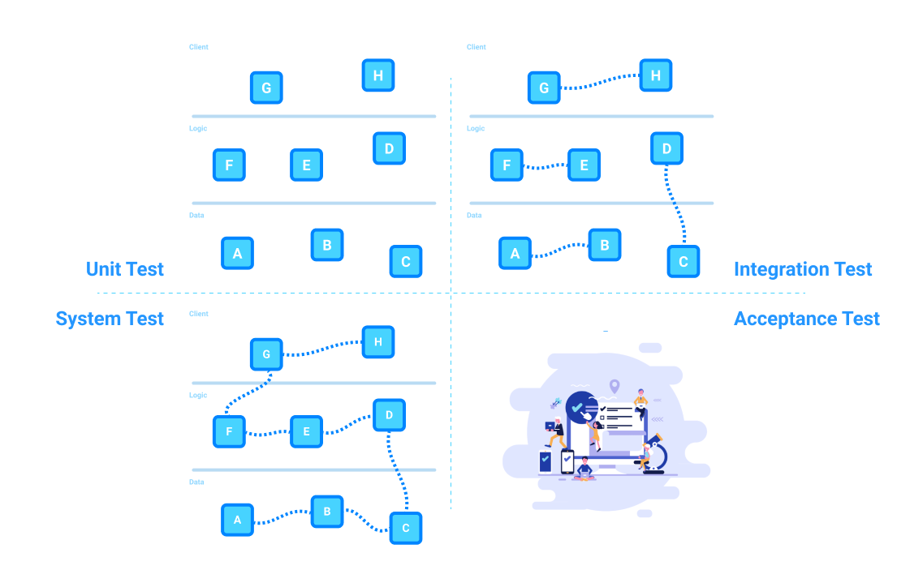
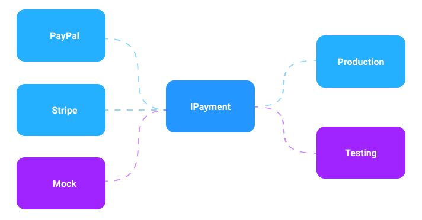

<!-- slide --->

## Test Exam 2020
Software Development, CPHBusiness

<!-- slide --->

## Testing What & Why?

_Murhy’s law_
_**"Anything that can go wrong will go wrong"**_

<!-- slide --->

## The Project Test Structure

<a href="https://github.com/SoftwareDevolopmentSem1/mocking-and-tdd/blob/master/Python/frontend_test.py" target="_blank">selenium source</a>

<!-- slide --->

## Dynamic Testing


<!-- slide --->

## Unit & Integration Testing
```java
// junit assertions
assertTrue(true == true);
assertFalse(true != false);

// hamcrest matcher assertions
assertThat(x, equal_to(y))
assertThat(x, is_not(equal_to(y)))
```

Hamcrest and Collections
```java
List<Integer> list = new ArrayList(5, 2, 4);

assertThat(list, hasSize(3));
assertThat(list, contains(5, 2, 4));
assertThat(list, containsInAnyOrder(2, 4, 5))
assertThat(list, everyItem(greaterThan(1)));
```
<!-- slide --->

## System Testing


<!-- slide --->

## Static Testing


<!-- slide --->

## Unit Testing Lifecycle
```java
@SetUp();       // @BeforeClass

@BeforeAll();   // @BeforeEach()
Test1() { ... }
@AfterAll();    // @AfterEach()

@AfterAll();    // @BeforeEach()
Test2() { ... }
@BeforeAll();   // @AfterEach()

@TearDown();    // @AfterClass
```

<a href="https://github.com/SoftwareDevolopmentSem1/mocking-and-tdd/blob/master/Banking/src/test/java/banking/DAOTest.java" target="_blank">lifecycle source</a>

<!-- slide --->

## Code & Path Coverage


<!-- slide --->

## Test Doubles
|||
|---|---|
| **Dummy** | Doesn't know anything |
| **Stub** | Knows what you told it |
| **Spy** | Stub with features |
| **Fake** | You cant tell the difference |
| **Mock** | Expects a lot |

<!-- slide --->

## Dummy
Doesn't know anything
```java
class BackendDummy implements IBackend {
    public String getUser(int id) {
        throw new NotImplementedException();
    }

    public int getRequestCount() {
        throw new NotImplementedException();
    }
}  
```

<!-- slide --->

## Stub
Knows what you told it
```java
class BackendStub implements IBackend {
    public String getUser(int id) {
        return new User();
    }

    public int getRequestCount() {
        return 10;
    }
}  
```

<!-- slide --->

## Spy
Stub with features
```java
class BackendStub implements IBackend {
    private int requestCount = 0;
    
    public String getUser(int id) {
        requestCount ++;
        return new User();
    }

    public int getRequestCount() {
        return requestCount;
    }
}  
```

<!-- slide --->

## Fake
You cant tell the difference
```java
class BackendStub implements IBackend {
    
    // pre-populated
    private List<User> users = new ArrayList();
    private int requestCount = 0;
    
    public String getUser(int id) {
        requestCount ++;
        return users.get(id);
    }

    public int getRequestCount() {
        return requestCount;
    }
}  
```

<!-- slide --->

## Mock
Expects a lot
```java
@Rule
public JUnitRuleMockery context = new JUnitRuleMockery();

@Test
Movement deposit = context.mock(Movement.class, "deposit");

context.checking(new Expectations() {{
    oneOf(deposit).getAmount();
    will(returnValue(100_00L));
}});

long mockResult = deposit.getAmount(); // 100_00L
```

<a href="https://github.com/SoftwareDevolopmentSem1/mocking-and-tdd/blob/master/Banking/src/test/java/banking/AccountTest.java" target="_blank">mock source</a>

<!-- slide -->

## Maintainability

| Obtain | Avoid |
|---|---|
|high coupling|cyclomatic complexity|
|low cohesion|temporal coupling|
|test driven development||
|inversion of control||
|continuos integration||
|interface & contracts||
|defensive programming||

<!-- slide -->

## Test Driven Development


<!-- slide -->

## Inversion of Control


<!-- slide -->

## Dependency Injection
Problem
```java
foo(String name, int age) {
    User user = new User(name, age);
    // code here ...
}
```

Solution
```java
foo(IUser user) {
    // code here...
}
```
```java
IUser user = new User(name, age);
foo(user);
```

<!-- slide -->

## Continuos Integration


<!-- slide -->

## Defensive Programming


<!-- slide -->

## Temporal Coupling
Example
```java
var calculator = new PriceCalculator();
calculator.UpdateCurrencyRates(eur: 1.02, gbp: 1.25);
decimal price = calculator.CalculatePrice(myShoppingCart);
```

Solution
```java
var calculator = new PriceCalculator(eur: 1.02, gbp: 1.25);
decimal price = calculator.CalculatePrice(myShoppingCart);
```

<!-- slide -->

## Cyclomatic Complexity
```java
foo() {
    if (condition) {                    // CC 1

        if (condition) {                // CC 2
            // code here...
        }

        while (condition) {             // CC 3

            if (condition) {            // CC 4
                // code here...
            } else {                    // CC 5
                // code here...
            }

        }  
    }
}
```

<!-- slide -->


